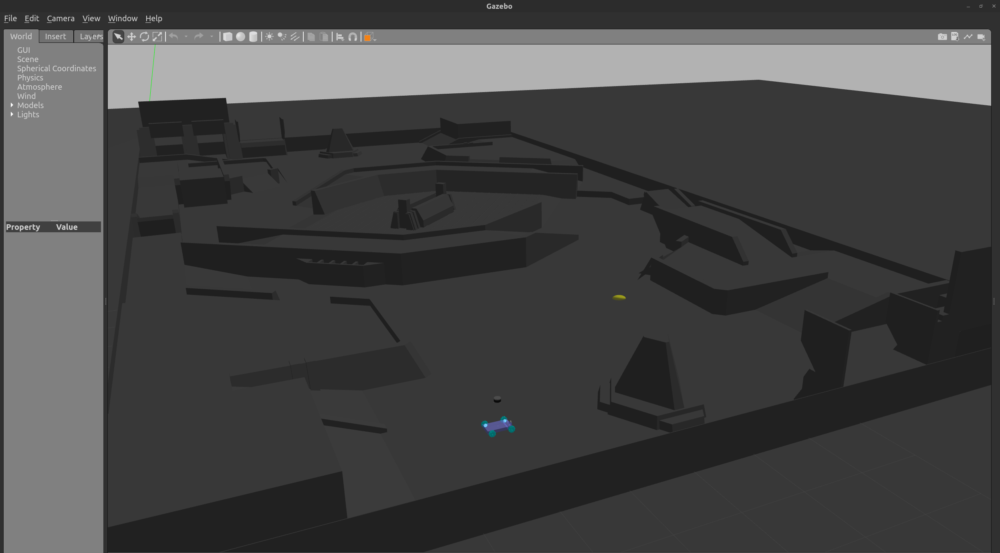

# robot_simulation说明

### 1、本包包含什么捏
    1.1、本包包含的机器人模型
#### 2、使用说明
    2.1、搭载HDL-32三维雷达的麦轮仿真
    2.2、搭载VLP-16三维雷达的麦轮仿真
    2.3、仿真控制机器人移动的键盘控制器
#### 3、依赖！！需要安装的
#### 4、接口

## 1、本包包含什么捏
该包提供基于物理仿真环境gazebo的机器人仿真及其对应的基于ros话题通讯的接口，同时也提供了rviz可视化界面观察相关传感器信息,gazebo地图使用了对抗赛版本。
### 1.1、本包包含的机器人模型
四轮麦轮机器人，可搭载三维机械式雷达（16线及32线都行），已经在launch中给出配置的launch文件


## 2、使用说明
基于ros2 humble版本桌面完整版，首先编译控制器：
``  colcon build --packages-select = genshin_simulation --symlink-install  ``
用launch一键启动，需要刷新当前环境变量``source ./install/setup.bash``：启动搭载16线三维雷达（velodyne）的麦轮小车：


### 2.1、搭载HDL-32三维雷达的麦轮仿真
启动：``ros2 launch genshin_simulation HDL32_car_launch.py``
### 2.2、搭载VLP-16三维雷达的麦轮仿真
启动：``ros2 launch genshin_simulation VLP16_car_launch.py``
### 2.3、仿真控制机器人移动的键盘控制器
``ros2 run  genshin_simulation teleop_twist_keyboard ``
键入档位决定速度如: 1、2、3、4、5、6 
键入q、w、e、a、s、d、z、x、c方向指行 
键入j、k、l旋转车体

## 3、依赖！！需要安装的
安装相关的velodyne仿真插件(其中对于三维雷达 velodyne 的仿真,其提供了与ros的接口转换)：
```

#ros2-humble：（这部分确实是几百Mb）
sudo apt-get install ros-humble-velodyne  
sudo apt-get install ros-humble-velodyne*

# 安装ros2不像ros1,会包含gazebo仿真环境，需要手动安装
sudo apt install ros-humble-gazebo-*

sudo apt install ros-humble-joint-state-publisher

```
## 4、接口
仿真给出的接口:
1. /cmd_vel 控制机器人运动的接口，其接收消息格式为``geometry_msgs/msg/Twist``,包含
```
geometry_msgs/msg/Vector3 linear
  float64 x
  float64 y
  float64 z
geometry_msgs/msg/Vector3 angular
  float64 x
  float64 y
  float64 z
```
``geometry_msgs/msg/Vector3 angular``为欧拉角控制，angular z为yaw角控制
2. /odom gazebo提供发布的odom里程计，应该是精确的，发布实时定位消息,格式为nav_msgs/Odometry,具体包含有效信息如下
```
std_msgs/msg/Header header
  uint32 seq
  time stamp
  string frame_id
string child_frame_id
geometry_msgs/msg/PoseWithCovariance pose
  geometry_msgs/msg/Pose pose
    geometry_msgs/msg/Point position
      float64 x
      float64 y
      float64 z
    geometry_msgs/msg/Quaternion orientation
      float64 x
      float64 y
      float64 z
      float64 w
  float64[36] covariance
geometry_msgs/msg/TwistWithCovariance twist
  geometry_msgs/msg/Twist twist
    geometry_msgs/msg/Vector3 linear
      float64 x
      float64 y
      float64 z
    geometry_msgs/msg/Vector3 angular
      float64 x
      float64 y
      float64 z
  float64[36] covariance
```
